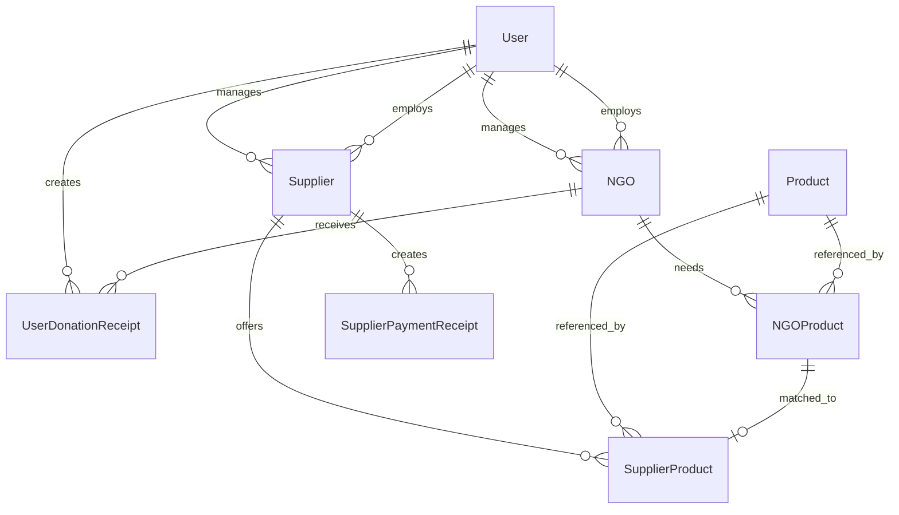
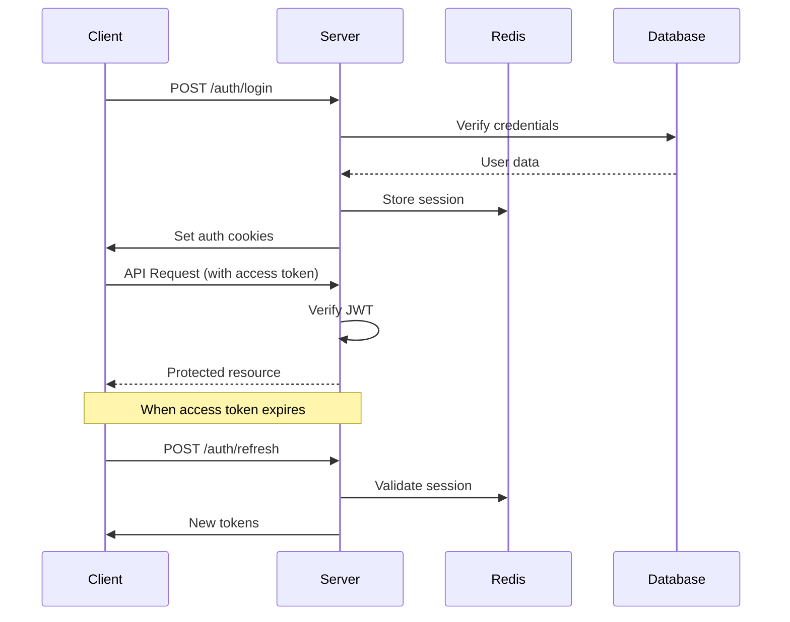

# SICRON Web Backend

A comprehensive Node.js/Express/TypeScript backend system for managing Non-Governmental Organizations (NGOs), Suppliers, Products, and Users with advanced authentication and authorization capabilities.

## 📋 Table of Contents

- [Overview](#overview)
- [Architecture](#architecture)
- [Features](#features)
- [Technologies](#technologies)
- [Installation](#installation)
- [Configuration](#configuration)
- [Database Schema](#database-schema)
- [Authentication System](#authentication-system)
- [API Endpoints](#api-endpoints)
- [Development](#development)
- [Deployment](#deployment)
- [Security](#security)
- [Contributing](#contributing)

## 🌟 Overview

SICRON Web Backend is designed to facilitate the coordination between NGOs, suppliers, and users in a structured ecosystem. The system enables NGOs to request products, suppliers to offer products, and users to manage their involvement with various organizations.

### Core Purpose
- **NGO Management**: Register and manage non-governmental organizations
- **Supplier Coordination**: Enable suppliers to offer products and services
- **Product Catalog**: Maintain a comprehensive product database
- **User Management**: Handle user authentication and authorization
- **Transaction Tracking**: Record donations and payments through receipts
- **Employment System**: Manage relationships between users and organizations

## 🏗️ Architecture

### Project Structure
```
src/
├── @types/              # Custom TypeScript type definitions
├── config/              # Configuration files
│   ├── cookies.ts       # Cookie configuration
│   ├── data-source.ts   # Database configuration
│   └── redis.ts         # Redis configuration
├── controllers/         # Request handlers
├── entities/            # Database entities (TypeORM)
├── middlewares/         # Express middleware
├── repositories/        # Data access layer
├── routers/            # Route definitions
├── scripts/            # Utility scripts
├── services/           # Business logic
└── utils/              # Utility functions
```

### Key Components

#### Entities (Data Models)
- **User**: Core user management with role-based access
- **NGO**: Non-governmental organizations
- **Supplier**: Supplier companies
- **Product**: Generic product definitions
- **NGOProduct**: Products needed by NGOs
- **SupplierProduct**: Products offered by suppliers
- **UserDonationReceipt**: Donation tracking
- **SupplierPaymentReceipt**: Payment tracking

#### Services
- **AuthService**: Centralized authentication logic
- **TokenService**: JWT token management
- **RefreshService**: Token refresh mechanism
- **EmploymentService**: User-organization relationships

#### Middlewares
- **authenticateUser**: Authentication middleware
- **cacheMiddleware**: Redis caching
- **errorHandler**: Global error handling

## ✨ Features

### 🔐 Authentication & Authorization
- **JWT-based authentication** with access/refresh token pattern
- **Role-based access control** with six distinct user roles
- **Session management** using Redis
- **Secure cookie handling** with configurable options
- **Token refresh mechanism** for seamless user experience

### 🏢 Organization Management
- **NGO Registration & Management**: Complete NGO lifecycle
- **Supplier Onboarding**: Supplier registration and verification
- **Multi-tenant Architecture**: Support for multiple organizations
- **Approval Workflow**: Pending status for new organizations

### 📦 Product Management
- **Generic Product Definitions**: Reusable product catalog
- **Supply-Demand Matching**: Connect NGO needs with supplier offers
- **Pricing & Availability**: Dynamic pricing and stock management
- **Product Categorization**: Organized product taxonomy

### 💰 Financial Tracking
- **Donation Receipts**: Track user donations to NGOs
- **Payment Records**: Monitor supplier payments
- **Financial Reporting**: Generate transaction summaries
- **Wallet Management**: Track NGO financial resources

### ⚡ Performance & Security
- **Redis Caching**: High-performance data caching
- **Rate Limiting**: API abuse prevention
- **CORS Configuration**: Cross-origin request handling
- **Helmet Security**: HTTP security headers
- **Compression**: Response compression
- **SWC Compilation**: Fast TypeScript compilation

## 🛠️ Technologies

### Core Stack
- **Node.js**: Runtime environment
- **TypeScript**: Type-safe JavaScript
- **Express.js**: Web application framework
- **TypeORM**: Object-Relational Mapping

### Database & Caching
- **MySQL**: Primary database
- **Redis**: Caching and session storage

### Authentication & Security
- **jsonwebtoken**: JWT token management
- **bcryptjs**: Password hashing
- **helmet**: Security middleware
- **cors**: Cross-origin resource sharing

### Development Tools
- **SWC**: Fast TypeScript compiler
- **ESLint**: Code linting
- **Prettier**: Code formatting
- **TypeDoc**: Documentation generation

## 🚀 Installation

### Prerequisites
- Node.js (v18+ recommended)
- MySQL (v8.0+)
- Redis (v6.0+)

### Setup Steps

1. **Clone the repository**
   ```bash
   git clone <repository-url>
   cd sicron-web-backend
   ```

2. **Install dependencies**
   ```bash
   npm install
   ```

3. **Environment Configuration**
   Create a `.env` file in the root directory:
   ```env
   # Database Configuration
   DB_HOST=localhost
   DB_PORT=3306
   DB_USERNAME=your_username
   DB_PASSWORD=your_password
   DB_NAME=sicron_db

   # Redis Configuration
   REDIS_HOST=localhost
   REDIS_PORT=6379
   REDIS_PASSWORD=

   # JWT Configuration
   JWT_SECRET=your_super_secret_jwt_key
   JWT_REFRESH_SECRET=your_super_secret_refresh_key

   # Server Configuration
   PORT=3000
   NODE_ENV=development

   # Cookie Configuration
   COOKIE_SECURE=false
   COOKIE_SAMESITE=lax
   COOKIE_DOMAIN=localhost
   ```

4. **Database Setup**
   ```bash
   # Create database
   mysql -u root -p -e "CREATE DATABASE sicron_db;"

   # Initialize database schema (TypeORM will handle this automatically)
   npm run dev
   ```

5. **Build the project**
   ```bash
   # Using SWC (recommended for production)
   npm run build

   # Using TypeScript (alternative)
   npm run build-tsc
   ```

6. **Start the server**
   ```bash
   # Development
   npm run dev

   # Production
   npm start
   ```

## ⚙️ Configuration

### Environment Variables

| Variable | Description | Default |
|----------|-------------|---------|
| `DB_HOST` | MySQL host | localhost |
| `DB_PORT` | MySQL port | 3306 |
| `DB_USERNAME` | Database username | - |
| `DB_PASSWORD` | Database password | - |
| `DB_NAME` | Database name | sicron_db |
| `REDIS_HOST` | Redis host | localhost |
| `REDIS_PORT` | Redis port | 6379 |
| `JWT_SECRET` | Access token secret | - |
| `JWT_REFRESH_SECRET` | Refresh token secret | - |
| `PORT` | Server port | 3000 |
| `NODE_ENV` | Environment mode | development |
| `COOKIE_SECURE` | Secure cookie flag | false |
| `COOKIE_SAMESITE` | SameSite cookie policy | lax |
| `COOKIE_DOMAIN` | Cookie domain | localhost |

### Cookie Configuration
The application uses three main cookies:
- `accessToken`: JWT access token (15-minute expiry)
- `refreshToken`: JWT refresh token (7-day expiry)
- `sessionId`: Server-side session identifier

## 🗄️ Database Schema

### Entity Relationships



### Key Tables

#### Users (`usertbl`)
- Primary identifier for all users in the system
- Supports role-based access control
- Manages relationships with NGOs and Suppliers

#### NGOs (`ngotbl`)
- Represents non-governmental organizations
- Contains financial wallet information
- Tracks approval status

#### Suppliers (`suppliers`)
- Represents supplier companies
- Stores business registration information
- Manages product offerings

#### Products (`products`)
- Generic product definitions
- Shared across NGOs and Suppliers
- Supports categorization

#### Receipts
- `user_donation_receipts`: User donations to NGOs
- `supplier_payment_receipts`: Supplier payment records

## 🔐 Authentication System

### Token-Based Authentication

The system implements a sophisticated JWT-based authentication flow:

#### Access Tokens
- **Purpose**: API authentication
- **Expiry**: 15 minutes
- **Storage**: HTTP-only cookies
- **Payload**: User UUID, email, role

#### Refresh Tokens
- **Purpose**: Token renewal
- **Expiry**: 7 days
- **Storage**: HTTP-only cookies
- **Validation**: Redis session storage

#### Session Management
- **Session ID**: Server-side session tracking
- **Storage**: Redis for high performance
- **Lifecycle**: Managed automatically

### Authentication Flow



### User Roles

| Role | Description | Permissions |
|------|-------------|-------------|
| `USER` | Basic user | Limited access |
| `ADMIN` | System administrator | Full access |
| `NGO_MANAGER` | NGO administrator | NGO management |
| `NGO_EMPLOYER` | NGO employee | NGO operations |
| `SUPPLIER_MANAGER` | Supplier administrator | Supplier management |
| `SUPPLIER_EMPLOYER` | Supplier employee | Supplier operations |

### Security Features

- **Password Hashing**: bcrypt with salt rounds
- **Token Validation**: JWT signature verification
- **Session Invalidation**: Redis-based session management
- **Rate Limiting**: 7000 requests per 15 minutes
- **CORS Protection**: Configurable origin policies
- **Security Headers**: Helmet middleware
- **Input Validation**: Request body validation

## 📡 API Endpoints

### Authentication Endpoints

| Method | Endpoint | Description | Auth Required |
|--------|----------|-------------|---------------|
| `POST` | `/auth/register` | Register new user | Optional |
| `POST` | `/auth/login` | User login | No |
| `POST` | `/auth/refresh` | Refresh tokens | No |
| `POST` | `/auth/logout` | User logout | No |
| `GET` | `/auth/logged` | Check login status | Optional |

### User Management

| Method | Endpoint | Description | Auth Required |
|--------|----------|-------------|---------------|
| `GET` | `/users` | List users | Yes (Role-based) |
| `GET` | `/users/:uuid` | Get user details | Yes (Role-based) |
| `PUT` | `/users/:uuid` | Update user | Yes (Owner/Admin) |
| `DELETE` | `/users/:uuid` | Delete user | Yes (Admin) |

### NGO Management

| Method | Endpoint | Description | Auth Required |
|--------|----------|-------------|---------------|
| `GET` | `/ngos` | List NGOs | Yes |
| `POST` | `/ngos` | Create NGO | Yes (NGO Manager) |
| `GET` | `/ngos/:uuid` | Get NGO details | Yes |
| `PUT` | `/ngos/:uuid` | Update NGO | Yes (Manager) |
| `DELETE` | `/ngos/:uuid` | Delete NGO | Yes (Admin) |

### Supplier Management

| Method | Endpoint | Description | Auth Required |
|--------|----------|-------------|---------------|
| `GET` | `/suppliers` | List suppliers | Yes |
| `POST` | `/suppliers` | Create supplier | Yes (Supplier Manager) |
| `GET` | `/suppliers/:uuid` | Get supplier details | Yes |
| `PUT` | `/suppliers/:uuid` | Update supplier | Yes (Manager) |
| `DELETE` | `/suppliers/:uuid` | Delete supplier | Yes (Admin) |

### Product Management

| Method | Endpoint | Description | Auth Required |
|--------|----------|-------------|---------------|
| `GET` | `/products` | List products | Yes |
| `POST` | `/products` | Create product | Yes (Admin) |
| `GET` | `/products/:uuid` | Get product details | Yes |
| `PUT` | `/products/:uuid` | Update product | Yes (Admin) |
| `DELETE` | `/products/:uuid` | Delete product | Yes (Admin) |

### NGO Products (Needs)

| Method | Endpoint | Description | Auth Required |
|--------|----------|-------------|---------------|
| `GET` | `/ngo-products` | List NGO needs | Yes |
| `POST` | `/ngo-products` | Create need | Yes (NGO) |
| `GET` | `/ngo-products/:id` | Get need details | Yes |
| `PUT` | `/ngo-products/:id` | Update need | Yes (NGO) |
| `DELETE` | `/ngo-products/:id` | Delete need | Yes (NGO) |

### Supplier Products (Offers)

| Method | Endpoint | Description | Auth Required |
|--------|----------|-------------|---------------|
| `GET` | `/supplier-products` | List supplier offers | Yes |
| `POST` | `/supplier-products` | Create offer | Yes (Supplier) |
| `GET` | `/supplier-products/:id` | Get offer details | Yes |
| `PUT` | `/supplier-products/:id` | Update offer | Yes (Supplier) |
| `DELETE` | `/supplier-products/:id` | Delete offer | Yes (Supplier) |

### Receipt Management

| Method | Endpoint | Description | Auth Required |
|--------|----------|-------------|---------------|
| `GET` | `/receipts/donations` | List donation receipts | Yes |
| `POST` | `/receipts/donations` | Create donation receipt | Yes |
| `GET` | `/receipts/payments` | List payment receipts | Yes |
| `POST` | `/receipts/payments` | Create payment receipt | Yes |

## 🛠️ Development

### Available Scripts

```bash
# Development
npm run dev          # Start development server with hot reload

# Building
npm run build        # Build using SWC (recommended)
npm run build-tsc    # Build using TypeScript compiler

# Production
npm start           # Start production server

# Database
npm run reset-db    # Reset database schema
npm run check-db    # Check database connectivity

# Code Quality
npm run lint        # Run ESLint
npm run format      # Format code with Prettier
npm run typecheck   # TypeScript type checking

# Documentation
npm run docs        # Generate HTML documentation
npm run docs:html   # Generate HTML docs
npm run docs:md     # Generate Markdown docs
```

### Development Workflow

1. **Code Style**: ESLint and Prettier configurations are included
2. **Type Safety**: Strict TypeScript configuration
3. **Hot Reload**: Development server with automatic restarts
4. **Database Sync**: Automatic schema synchronization in development
5. **Documentation**: Auto-generated API documentation

### Testing

The project includes comprehensive error handling and logging. To test the system:

```bash
# Start the development server
npm run dev

# Test authentication
curl -X POST http://localhost:3000/auth/login \
  -H "Content-Type: application/json" \
  -d '{"email": "test@example.com", "password": "password"}'

# Test protected endpoints
curl -X GET http://localhost:3000/users \
  -H "Cookie: accessToken=your_token; refreshToken=your_refresh_token"
```

## 🚀 Deployment

### Production Considerations

1. **Environment Variables**: Set production values
2. **Database**: Use production MySQL instance
3. **Redis**: Configure production Redis cluster
4. **SSL/TLS**: Enable secure cookies in production
5. **Process Management**: Use PM2 or similar

### Docker Deployment

```dockerfile
FROM node:18-alpine

WORKDIR /app
COPY package*.json ./
RUN npm ci --only=production

COPY . .
RUN npm run build

EXPOSE 3000
CMD ["npm", "start"]
```

### Environment Setup

```env
# Production Environment
NODE_ENV=production
COOKIE_SECURE=true
COOKIE_SAMESITE=strict
DB_HOST=your_production_db_host
REDIS_HOST=your_production_redis_host
```

### Performance Optimization

- **SWC Compilation**: Faster than traditional TypeScript
- **Redis Caching**: Reduces database load
- **Compression**: Reduces response size
- **Rate Limiting**: Prevents abuse
- **Connection Pooling**: Optimized database connections

## 🔒 Security

### Security Measures

1. **Authentication**:
   - JWT tokens with short expiration
   - Secure HTTP-only cookies
   - Session management via Redis

2. **Authorization**:
   - Role-based access control
   - Route-level permissions
   - Resource ownership validation

3. **   - Password hashingData Protection**:
 with bcrypt
   - SQL injection prevention via TypeORM
   - XSS protection via Helmet

4. **Infrastructure**:
   - Rate limiting (7000 requests/15min)
   - CORS configuration
   - Security headers
   - Input validation

### Security Best Practices

- Never log sensitive information
- Use environment variables for secrets
- Enable secure cookies in production
- Implement proper error handling
- Regular security audits
- Keep dependencies updated

## 🤝 Contributing

### Development Setup

1. Fork the repository
2. Create a feature branch
3. Make your changes
4. Run tests and linting
5. Submit a pull request

### Code Standards

- Follow TypeScript best practices
- Use meaningful variable names
- Add TypeDoc comments
- Maintain test coverage
- Follow existing patterns

### Documentation

- Update README for significant changes
- Add TypeDoc comments to new code
- Update API documentation
- Include examples for new features

## 📄 License

This project is licensed under the BSD-3-Clause-Clear License. See the LICENSE file for details.

## 📞 Support

For support and questions:

- Create an issue in the repository
- Check the documentation
- Review the API endpoints
- Contact the development team

---

**SICRON Web Backend** - Empowering NGO-Supplier coordination through technology.
